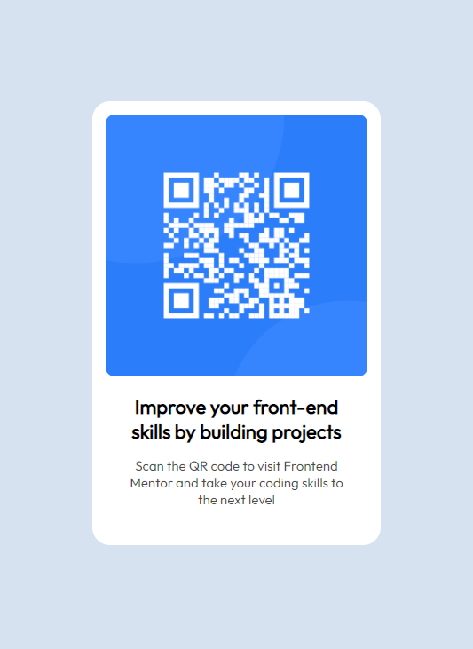

# qr-code-component
QR code component 

## Table of contents

- [Overview](#overview)
  - [Screenshot](#screenshot)
  - [Links](#links)
  - [Built with](#built-with)

## Overview

Just simple QR code page - 

### Screenshot

### Links

- Live Site URL: [QR Code - App](https://qr-code-component-liart.vercel.app/)

### Built with

- Semantic HTML5 markup
- CSS custom properties
